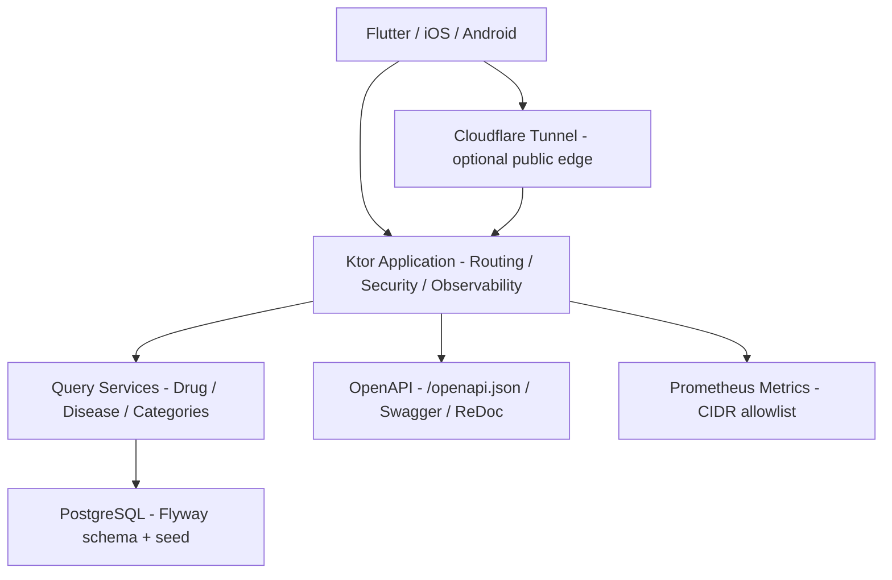

<!-- markdownlint-disable MD013 MD033 MD041 -->


# fictional-drug-and-disease-ref-backend-kotlin

Kotlin / Ktor で実装した、架空の医薬品・疾患リファレンス API バックエンドです。Flutter / iOS / Android クライアントが利用する API contract を、実 DB、typed domain model、OpenAPI、コンテナ起動スクリプトで検証できるようにしています。クライアント実装の例: [fictional-drug-and-disease-ref-flutter](https://github.com/Corvus400/fictional-drug-and-disease-ref-flutter)。

[](https://kotlinlang.org/)
[](https://ktor.io/)
[](https://www.postgresql.org/)
[](./LICENSE)
[](https://pre-commit.com/)

## DISCLAIMER

これは架空の医薬品・疾患データを返す API バックエンドです。
内容は実在の医薬品・疾患・治療法を表すものではなく、
医療判断・診療・自己判断に使用してはなりません。
This API returns FICTIONAL drug and disease data.
DO NOT use for medical decisions or clinical practice.

詳細は [DISCLAIMER.md](DISCLAIMER.md) を参照してください。

## 主な特徴

- **実 DB backed API**: PostgreSQL、Flyway migration、seed data を使い、mock baseline からの移行先として動かせます。
- **Ktor 3 の production surface**: RFC 9457 形式の problem response、JWT admin route、CORS、rate limiting、structured logging、Prometheus metrics を備えます。
- **OpenAPI contract gate**: `/openapi.json` と `contract/mock-openapi.json` の 2xx response schema 互換をテストで確認します。
- **Apple Container local deploy**: `scripts/start.sh` で PostgreSQL と app を起動し、non-root / read-only rootfs / localhost bind でローカル検証できます。
- **公開運用の前提を分離**: 通常起動はローカルのみ、Cloudflare Tunnel 公開は明示フラグで起動する設計です。

## クイックスタート

```bash
./scripts/setup.sh
./scripts/start.sh
curl -s http://127.0.0.1:18080/health/ready
curl -s 'http://127.0.0.1:18080/v1/drugs?page=1&page_size=5'
./scripts/stop.sh
```

`./scripts/start.sh` は fresh な PostgreSQL コンテナを起動し、database readiness を待ち、application image を build し、Flyway migration 後に API を `127.0.0.1:18080` のみに公開します。

## 動作環境

- macOS 26 以降
- JDK 21+
- Apple Container 0.8.x
- Apple Silicon で x86_64 image を実行する場合は Rosetta 2
- Docker / Colima など、Testcontainers を動かせるローカル Docker runtime

## アーキテクチャ

Ktor application、PostgreSQL、OpenAPI、Cloudflare Tunnel 公開経路を分離しています。API の詳細は live OpenAPI を正とし、README は責務境界と運用上の入口だけを記載します。



## 開発

```bash
# テスト
./gradlew test

# コードスタイル確認・修正
./gradlew spotlessCheck
./gradlew spotlessApply

# 静的解析
./gradlew detektMain detektTest

# Fat JAR
./gradlew buildFatJar
```

### Probe Mapping

| Platform probe | Endpoint | Expected success | Dependency check | Operational meaning |
| --- | --- | --- | --- | --- |
| Liveness | `/health` | `200 {"status":"ok"}` | None | Process is running. Do not point this at the database-dependent readiness probe. |
| Readiness | `/health/ready` | `200 {"status":"ready"}` | PostgreSQL `Connection.isValid(1)` | Instance can receive traffic. Returns `503 {"status":"not_ready"}` when the database is unavailable. |

Use `/health` for restart decisions and `/health/ready` for traffic routing. A transient database outage should remove the instance from traffic, not restart the process.

### Metrics

`/metrics` exposes Prometheus metrics and is guarded by a CIDR allowlist based on the real socket peer address. The default allowlist is intended for local and private-network operational access. Cloudflare Tunnel deployment adds an edge-level `/metrics` block so public traffic cannot scrape internal metrics.

### Local Verification

```bash
./scripts/start.sh
curl -s -o /dev/null -w '%{http_code}\n' http://127.0.0.1:18080/health
curl -s -o /dev/null -w '%{http_code}\n' http://127.0.0.1:18080/health/ready
container stop fictional-drugref-backend-postgres
curl -s -o /dev/null -w '%{http_code}\n' http://127.0.0.1:18080/health/ready
curl -s -o /dev/null -w '%{http_code}\n' http://127.0.0.1:18080/health
./scripts/stop.sh
```

### Cloudflare Tunnel Publishing

The default startup path is local only. The application binds the host port to
`127.0.0.1:18080`, and PostgreSQL is not published to the host. Do not add a
router port-forward for `18080`; public traffic is expected to arrive only
through `cloudflared`.

One-time setup:

```bash
TUNNEL_HOSTNAME=fictional-drugref.win ./scripts/setup.sh
```

`setup.sh` installs or checks `cloudflared`, opens the Cloudflare browser login
when needed, creates or reuses the named tunnel
`fictional-drugref-backend`, routes DNS for the hostname, writes
`cloudflared/config.yml`, and restricts the Cloudflare certificate and
credential file permissions.

Daily operation:

```bash
./scripts/start.sh --public
./scripts/stop.sh
```

`start.sh --public` starts PostgreSQL, the Ktor app, and a background
Cloudflare Tunnel process. It generates runtime-only database and JWT secrets
for public mode and injects them through temporary env files. `stop.sh` stops
the tunnel and deletes the local containers.

The committed `cloudflared/config.yml.example` blocks `/metrics` at the
Cloudflare ingress before forwarding other requests to `http://localhost:18080`.
Keep the generated `cloudflared/config.yml`, tunnel credentials, and PID/log
files out of Git. If credentials are exposed, revoke or recreate the tunnel.

Cloudflare Access is intentionally not required for this fictional public API.
Admin endpoints remain protected by the app's JWT layer. Add Access later only
if the project starts handling real sensitive data, compliance requirements, or
multiple human operators.

### コミット前 / push ゲート

ローカル hook は commit 前の gitleaks と pre-commit の Spotless ratchet を維持します。重い pre-push gate は CI に移管します。

```bash
brew install pre-commit
pre-commit install --hook-type pre-commit
```

`core.hooksPath` を設定している環境では `pre-commit install` が拒否されます。その場合は既存のグローバル hook から以下を呼び出してください。

```bash
pre-commit run --hook-stage pre-commit
```

- `pre-commit` stage: `git fetch origin main` 後に `./gradlew spotlessCheck -Pspotless.ratchet=true`
- global git `pre-commit`: staged diff を `gitleaks git --pre-commit --staged --redact --verbose .` で scan
- CI gate: `test` / `spotlessCheck` / `detektMain` / `detektTest` / OpenAPI contract / image build
- Markdown・Shell・YAML など対象外ファイルだけの変更では、pre-commit hook は何もせず成功終了する
- 全件確認: `pre-commit run --all-files`

Spotless は `origin/main` からの差分に ratchet します。古い base を参照しないよう、pre-commit stage は Spotless 実行前に `git fetch origin main` を自動実行します。

## リポジトリ運用

- 依存関係更新の Pull Request は Renovate / Dependabot が管理します。
- GitHub Actions と workflow 依存関係の更新は SHA pinning と selected actions を維持したまま手動レビューで適用します。
- 外部からの Pull Request はレビュー対象外です。
- 一般的なサポート・機能要望・通常のバグ報告は GitHub Issues では受け付けていません。
- 公開 Issue は repository hygiene report のみに限定し、秘密情報・個人情報・脆弱性詳細を投稿しない導線にしています。
- セキュリティ報告は [SECURITY.md](./SECURITY.md) の手順に従ってください。

## セキュリティ / 公開前確認

- GitHub 履歴の author email は GitHub noreply に統一しています。
- tracked tree、Git 履歴、GitHub Issue / Pull Request / コメント / Actions log に対して、秘密情報・ローカル絶対パス・個人メールの混入を確認します。
- コンテナ image には secret を焼き込まず、runtime configuration は env から注入します。
- ローカル起動では app port を `127.0.0.1` に bind し、PostgreSQL は host に publish しません。
- Cloudflare Tunnel 公開時は `/metrics` を edge で遮断し、origin direct access を開けない運用にします。
- 公開後は GitHub secret scanning / push protection / Dependabot security updates の有効化状態を確認します。

## ライセンス

本プロジェクトは [MIT License](./LICENSE) で公開しています。
