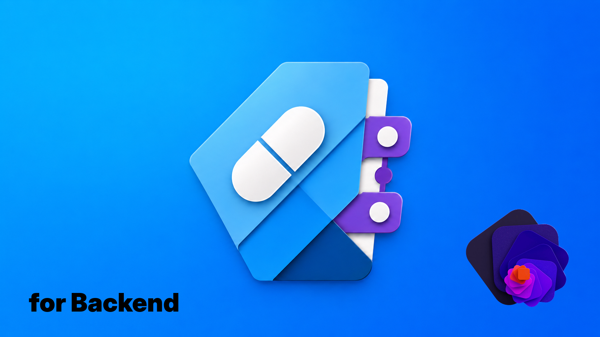
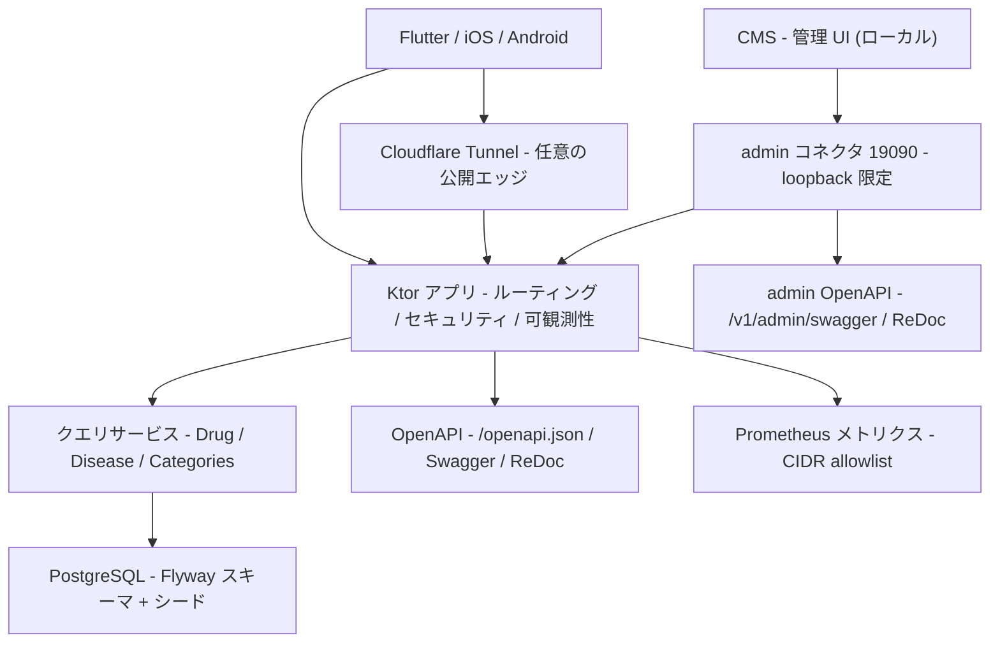

<!-- markdownlint-disable MD013 MD033 MD041 -->



# fictional-drug-and-disease-ref-backend-kotlin

Kotlin / Ktor で実装した、架空の医薬品・疾患リファレンス API バックエンドです。Flutter / iOS / Android クライアントが利用する API コントラクトを、実 DB、型付きドメインモデル、OpenAPI、コンテナ起動スクリプトで検証できるようにしています。クライアント実装の例: [fictional-drug-and-disease-ref-flutter](https://github.com/Corvus400/fictional-drug-and-disease-ref-flutter)。

[](https://kotlinlang.org/)
[](https://ktor.io/)
[](https://www.postgresql.org/)
[](./LICENSE)
[](https://pre-commit.com/)

## DISCLAIMER

これは架空の医薬品・疾患データを返す API バックエンドです。
内容は実在の医薬品・疾患・治療法を表すものではなく、
医療判断・診療・自己判断に使用してはなりません。
This API returns FICTIONAL drug and disease data.
DO NOT use for medical decisions or clinical practice.

詳細は [DISCLAIMER.md](DISCLAIMER.md) を参照してください。

## 主な特徴

- **実 DB バックの API**: PostgreSQL、Flyway マイグレーション、シードデータを使い、モックベースラインからの移行先として動かせます。
- **Ktor 3 のプロダクション機能一式**: RFC 9457 形式の problem レスポンス、JWT 管理ルート、CORS、レート制限、構造化ログ、Prometheus メトリクスを備えます。
- **OpenAPI コントラクトゲート**: `/openapi.json` と `contract/mock-openapi.json` の 2xx レスポンススキーマ互換をテストで確認します。
- **CMS 連携**: 隣接する [CMS](https://github.com/Corvus400/fictional-drug-and-disease-ref-cms) の編集 UI 向けに admin CRUD WebAPI を提供し、admin コネクタ専用の Swagger / ReDoc で仕様を公開します。詳細は [docs/cms-integration.md](docs/cms-integration.md) を参照してください。
- **Apple Container ローカルデプロイ**: `scripts/start.sh` で PostgreSQL とアプリを起動し、非 root / read-only rootfs / localhost バインドでローカル検証できます。
- **公開運用の前提を分離**: 通常起動はローカルのみ、Cloudflare Tunnel 公開は明示フラグで起動する設計です。

## クイックスタート

```bash
./scripts/setup.sh
./scripts/start.sh
curl -s http://127.0.0.1:18080/health/ready
curl -s 'http://127.0.0.1:18080/v1/drugs?page=1&page_size=5'
# CMS: http://127.0.0.1:5173/
./scripts/stop.sh
```

`./scripts/start.sh` はクリーンな PostgreSQL コンテナを起動し、データベースの準備完了を待ち、アプリケーションイメージをビルドし、Flyway マイグレーション後に read API を `127.0.0.1:18080`、admin API を `127.0.0.1:19090` に公開します。隣接するチェックアウトに `fictional-drug-and-disease-ref-cms` がある場合は CMS の開発サーバーも `127.0.0.1:5173` で起動します。

CMS を起動しない場合は `CMS_ENABLED=false ./scripts/start.sh` を使います。CMS チェックアウトの場所が異なる場合は `CMS_DIR=/path/to/fictional-drug-and-disease-ref-cms ./scripts/start.sh` を指定してください。

### ブラウザで確認

- 公開 API (read API, `127.0.0.1:18080`)
  - Swagger UI: <http://127.0.0.1:18080/swagger>
  - ReDoc: <http://127.0.0.1:18080/redoc>
  - OpenAPI JSON: <http://127.0.0.1:18080/openapi.json>
- 管理 API (admin コネクタ, `127.0.0.1:19090`、CMS 連携用・ローカル限定)
  - Swagger UI: <http://127.0.0.1:19090/v1/admin/swagger>
  - ReDoc: <http://127.0.0.1:19090/v1/admin/redoc>
  - OpenAPI JSON: <http://127.0.0.1:19090/v1/admin/openapi.json>

管理 API の OpenAPI は admin コネクタ (ポート `19090`) でのみ提供され、公開ポート (`18080`) の `/openapi.json` には含まれません。

## 動作環境

- macOS 26 以降
- JDK 21+
- Apple Container 0.8.x
- Apple Silicon で x86_64 イメージを実行する場合は Rosetta 2
- Docker / Colima など、Testcontainers を動かせるローカルの Docker ランタイム

## アーキテクチャ

Ktor アプリケーション、PostgreSQL、OpenAPI、Cloudflare Tunnel 公開経路、CMS 連携用の admin コネクタを分離しています。公開 API の詳細は稼働中の OpenAPI を正とし、README は責務境界と運用上の入口だけを記載します。read API は公開コネクタ (`18080`)、admin API は loopback 限定の admin コネクタ (`19090`) で物理的に分離します。



## 開発

```bash
# テスト
./gradlew test

# コードスタイル確認・修正
./gradlew spotlessCheck
./gradlew spotlessApply

# 静的解析
./gradlew detektMain detektTest

# Fat JAR
./gradlew buildFatJar
```

### Probe マッピング

| プラットフォーム probe | エンドポイント | 成功時の応答 | 依存チェック | 運用上の意味 |
| --- | --- | --- | --- | --- |
| Liveness | `/health` | `200 {"status":"ok"}` | なし | プロセスが稼働中であることを示します。データベース依存の readiness probe をこれに向けないでください。 |
| Readiness | `/health/ready` | `200 {"status":"ready"}` | PostgreSQL `Connection.isValid(1)` | インスタンスがトラフィックを受け付け可能であることを示します。データベースが利用不可のときは `503 {"status":"not_ready"}` を返します。 |

再起動の判断には `/health`、トラフィックのルーティングには `/health/ready` を使います。一時的なデータベース障害ではプロセスを再起動せず、インスタンスをトラフィックから外すべきです。

### メトリクス

`/metrics` は Prometheus メトリクスを公開し、実際のソケットピアアドレスに基づく CIDR allowlist で保護されます。デフォルトの allowlist はローカルおよびプライベートネットワークからの運用アクセスを想定しています。Cloudflare Tunnel での公開時はエッジレベルで `/metrics` を遮断し、公開トラフィックが内部メトリクスを scrape できないようにします。

### 管理 API アクセス

管理ルートは `/v1/admin` 配下にあり、ローカルの admin コネクタ経由でのみ到達できます。
公開コネクタは `/v1/admin/*` に対して、preflight リクエストを含め、未知のルートと
同じ problem+json 404 を返します。Cloudflare Tunnel など公開エッジを admin コネクタに
向けないでください。

`POST /v1/admin/token` は開発ツールと CMS 向けの、認証不要なローカルブートストラップ
エンドポイントです。ローカルからの到達可能性を信頼しており、admin コネクタに到達できる
プロセスであれば誰でも admin JWT を発行できます。信頼できる単一ユーザーの開発ホストでのみ
使用し、`JWT_SECRET` は環境変数に保持し、トークンをログ・Issue・Pull Request・
スクリーンショットに貼り付けないでください。CLI から使う場合は `./gradlew printAdminToken`
が `JWT_SECRET` で署名したトークンを出力します。

ローカル起動スクリプトは admin コネクタを `127.0.0.1:19090` でのみ公開し、
`127.0.0.1:5173` / `localhost:5173` 向けの CMS CORS オリジンを注入します。
`ADMIN_HOST=0.0.0.0` は `ALLOW_CONTAINER_ADMIN_WILDCARD_BIND=true` で保護された
コンテナ内部バインドの例外としてのみ使用し、JVM 直接起動はデフォルトで loopback 限定の
ままです。トークン応答には正準の `access_token` フィールドと、CMS 互換の `token` エイリアスの
両方が含まれます。

CMS が利用する admin CRUD WebAPI の一覧・リクエスト/レスポンススキーマは、admin コネクタ専用の
Swagger UI (<http://127.0.0.1:19090/v1/admin/swagger>) / ReDoc を正とします。CMS の起動方法・
トークンブートストラップ・ETag/If-Match による楽観ロック契約・CORS など連携の詳細は
[docs/cms-integration.md](docs/cms-integration.md) を参照してください。

### ローカル動作確認

```bash
./scripts/start.sh
curl -s -o /dev/null -w '%{http_code}\n' http://127.0.0.1:18080/health
curl -s -o /dev/null -w '%{http_code}\n' http://127.0.0.1:18080/health/ready
curl -s -o /dev/null -w '%{http_code}\n' http://127.0.0.1:19090/health/ready
curl -s -o /dev/null -w '%{http_code}\n' http://127.0.0.1:5173/
container stop fictional-drugref-backend-postgres
curl -s -o /dev/null -w '%{http_code}\n' http://127.0.0.1:18080/health/ready
curl -s -o /dev/null -w '%{http_code}\n' http://127.0.0.1:18080/health
./scripts/stop.sh
```

### Cloudflare Tunnel 公開

デフォルトの起動経路はローカルのみで、アプリは `127.0.0.1:18080` にバインドします。
公開する場合は `cloudflared` 経由でのみ到達させる設計で、`18080` のルーターポート
フォワードは追加しません。

```bash
# 初回セットアップ
TUNNEL_HOSTNAME=fictional-drugref.win ./scripts/setup.sh

# 公開起動 / 停止
./scripts/start.sh --public
./scripts/stop.sh
```

管理エンドポイントは公開トンネル経由でルーティングされず、loopback 限定の admin コネクタに
留まります。セットアップ手順・公開モードの秘密情報生成・`CMS_ENABLED` の挙動・設定ファイルと
認証情報の取り扱い・Cloudflare Access の方針など詳細は
[docs/cloudflare-tunnel.md](docs/cloudflare-tunnel.md) を参照してください。

### コミット前 / push ゲート

ローカルフックはコミット前の gitleaks と pre-commit の Spotless ratchet を維持します。重い pre-push ゲートは CI に移管します。

```bash
brew install pre-commit
pre-commit install --hook-type pre-commit
```

`core.hooksPath` を設定している環境では `pre-commit install` が拒否されます。その場合は既存のグローバル hook から以下を呼び出してください。

```bash
pre-commit run --hook-stage pre-commit
```

- `pre-commit` stage: `git fetch origin main` 後に `./gradlew spotlessCheck -Pspotless.ratchet=true`
- global git `pre-commit`: ステージ済みの差分を `gitleaks git --pre-commit --staged --redact --verbose .` でスキャン
- CI ゲート: `test` / `spotlessCheck` / `detektMain` / `detektTest` / OpenAPI コントラクト / イメージビルド
- Markdown・Shell・YAML など対象外ファイルだけの変更では、pre-commit フックは何もせず成功終了する
- 全件確認: `pre-commit run --all-files`

Spotless は `origin/main` からの差分に ratchet します。古い base を参照しないよう、pre-commit stage は Spotless 実行前に `git fetch origin main` を自動実行します。

## リポジトリ運用

- 依存関係更新の Pull Request は Renovate / Dependabot が管理します。
- GitHub Actions とワークフロー依存関係の更新は、SHA ピン留めと許可対象 actions を維持したまま手動レビューで適用します。
- 外部からの Pull Request はレビュー対象外です。
- 一般的なサポート・機能要望・通常のバグ報告は GitHub Issues では受け付けていません。
- 公開 Issue はリポジトリ衛生レポートのみに限定し、秘密情報・個人情報・脆弱性詳細を投稿しない導線にしています。
- セキュリティ報告は [SECURITY.md](./SECURITY.md) の手順に従ってください。

## ライセンス

本プロジェクトは [MIT License](./LICENSE) で公開しています。
